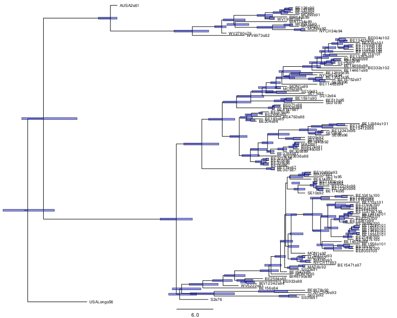

# Time-stamped data

This tutorial estimates the rate of evolution from a set of virus
sequences which have been isolated at different points in time
(heterochronous or time-stamped data). The data are 129 sequences from
the G (attachment protein) gene of human respiratory syncytial virus
subgroup A (RSVA) from various parts of the world with isolation dates
ranging from 1956-2002 
(, ). 
RSVA causes
infections of the lower respiratory tract causing symptoms that are
often indistinguishable from the common cold. By age 3, nearly all
children will be infected and a small percentage (<3%) will develop
more serious inflammation of the bronchioles requiring hospitalisation.

The aim of this tutorial is to obtain estimates for :

-   the rate of molecular evolution

-   the date of the most recent common ancestor

-   the phylogenetic relationships with measures of statistical support.

The following software will be used in this tutorial:

-   **BEAST** - this package contains the BEAST program, BEAUti,
    DensiTree, TreeAnnotator and other utility programs. This tutorial
    is written for BEAST v`2.5.x`, which has support for multiple
    partitions. It is available for download from\
    [http://www.beast2.org](http://www.beast2.org).

-   **Tracer** - this program is used to explore the output of BEAST
    (and other Bayesian MCMC programs). It graphically and quantitively
    summarises the distributions of continuous parameters and provides
    diagnostic information. At the time of writing, the current version
    is v`1.7`. It is available for download from
    [http://beast.community/tracer](http://beast.community/tracer).

-   **FigTree** - this is an application for displaying and printing
    molecular phylogenies, in particular those obtained using BEAST. At
    the time of writing, the current version is v`1.4.3`. It is
    available for download from [http://beast.community/figtree]http://beast.community/figtree).

## The NEXUS alignment {#the-nexus-alignment .unnumbered}

The data is in a file called
[RSV2.nex](https://github.com/CompEvol/beast2/blob/master/examples/nexus/RSV2.nex?raw=true).
You can find it in the `examples/nexus` directory in the directory
where BEAST was installed. Or click the link to download the data. After
the data is opened in your web browser, right click mouse and save it as
`RSV2.nex`.

This file contains an alignment of 129 sequences from the G gene of RSVA
virus, 629 nucleotides in length. Import this alignment into BEAUti.
Because this is a protein-coding gene we are going to split the
alignment into three partitions representing each of the three codon
positions. To do this we will click the `Split` button at the
bottom of the `Partitions` panel and then select the `1 + 2 + 3
frame 3` from the drop-down menu (Figure \[fig:BEAUti\_split\]).

<figure>
	<a name="fig:BEAUti\_split"></a>
	
	<figcaption>Figure 1: Split the alignment</figcaption>
</figure>
<br>

This signifies that the first full codon starts at the third nucleotide
in the alignment. This will create three rows in the partitions panel.
You will have to re-link the tree and clock models across the three
partitions (and name them “tree` and “clock` respectively) before
continuing to the next step. The partition panel should now look
something like this:

<figure>
	<a name="fig:BEAUti\_partition"></a>
	
	<figcaption>Figure 2: A screenshot of the Partitions tab in BEAUti</figcaption>
</figure>
<br>

## Tip dates {#tip-dates .unnumbered}

By default all the taxa are assumed to have a date of zero (i.e. the
sequences are assumed to be sampled at the same time). In this case, the
RSVA sequences have been sampled at various dates going back to the
1950s. The actual year of sampling is given in the name of each taxon
and we could simply edit the value in the Date column of the table to
reflect these. However, if the taxa names contain the calibration
information, then a convenient way to specify the dates of the sequences
in BEAUti is to click the checkbox `Use tip dates` and then use
the `Configure` button at the top of the `Tip Dates` panel.
Clicking this will make a dialog box appear.

<figure>
	<a name="fig:BEAUti\_GuessDates"></a>
	
	<figcaption>Figure 3: Guess dates dialog</figcaption>
</figure>
<br>

Select the option to `use everything`, choose `after last` from from
drop-down box and type‘s’ into the corresponding text box. This will
extract the trailing numbers from the taxon names after the last little
’s’, which are interpreted as the year (in this case since 1900) that
the sample was isolated.

The dates panel should now look something like this:

<figure>
	<a name="fig:BEAUti\_dates"></a>
	
	<figcaption>Figure 4: Dates panel</figcaption>
</figure>
<br>

## Setting the substitution model {#setting-the-substitution-model .unnumbered}

We will use the HKY model with empirical base frequencies for all three
partitions. To do this first link the site partitions and then choose
HKY and Empirical from the Subst Model and Frequencies drop-boxes. Also
check the estimate box for the Mutation Rate,which will finally trigger
to check the “Fix mean mutation rate` box.

<figure>
	<a name="fig:BEAUti\_Site\_Model"></a>
	
	<figcaption>Figure 5: Site model</figcaption>
</figure>
<br>

Then, hold ‘shift’ key to select all site models on the left side, and
click `OK` to clone the setting from defined site model (Figure
\[fig:cloneFrom\]). Go through each site model, as you can see, their
configurations are same now.

<figure>
	<a name="fig:cloneFrom"></a>
	
	<figcaption>Figure 6: Clone configuration from one site model to others.</figcaption>
</figure>
<br>


### Priors 

To set up the priors, select the `Priors` tab. Choose `Coalescent
Constant Population` for the tree prior. Set the prior on the clockRate
parameter to a log-normal with `M=-5` and `S=1.25`.

<figure>
	<a name="fig:BEAUti\_priors"></a>
	
	<figcaption>Figure 7: Priors</figcaption>
</figure>
<br>

## Setting the MCMC options

For this dataset let’s initially set the chain length to as this will
run reasonably quickly on most modern computers. Set the sampling
frequencies for the screen to to , the trace log file to and the trees
file to .

<figure>
	<a name="fig:BEAUti\_mcmc"></a>
	
	<figcaption>Figure 8: MCMC options</figcaption>
</figure>
<br>

## Running BEAST {#running-beast .unnumbered}

Save the BEAST file (e.g. `RSV2.xml`) and run it in BEAST.

<figure>
	<a name="fig:BEAST"></a>
	
	<figcaption>Figure 9: A screenshot of BEAST.</figcaption>
</figure>
<br>

Now run BEAST and when it asks for an input file, provide your newly
created XML file as input. BEAST will then run until it has finished
reporting information to the screen. The actual results files are save
to the disk in the same location as your input file. The output to the
screen will look something like this:

```
                 BEAST v2.2.0, 2002-2014
           Bayesian Evolutionary Analysis Sampling Trees
                     Designed and developed by
    Remco Bouckaert, Alexei J. Drummond, Andrew Rambaut and Marc A. Suchard
                                  
                   Department of Computer Science
                       University of Auckland
                      remco@cs.auckland.ac.nz
                      alexei@cs.auckland.ac.nz
                                  
                 Institute of Evolutionary Biology
                      University of Edinburgh
                         a.rambaut@ed.ac.uk
                                  
                  David Geffen School of Medicine
               University of California, Los Angeles
                         msuchard@ucla.edu
                                  
                    Downloads, Help & Resources:
                            http://beast2.org/
                                  
    Source code distributed under the GNU Lesser General Public License:
                    http://github.com/CompEvol/beast2
                                  
                         BEAST developers:
        Alex Alekseyenko, Trevor Bedford, Erik Bloomquist, Joseph Heled, 
        Sebastian Hoehna, Denise Kuehnert, Philippe Lemey, Wai Lok Sibon Li, 
        Gerton Lunter, Sidney Markowitz, Vladimir Minin, Michael Defoin Platel, 
                Oliver Pybus, Chieh-Hsi Wu, Walter Xie
                                  
                             Thanks to:
            Roald Forsberg, Beth Shapiro and Korbinian Strimmer

    ... ...

            1999000     -6131.9540        80.2        -5496.4810      -635.4730 2m3s/Msamples
            2000000     -6142.7389        80.7        -5506.2818      -636.4570 2m3s/Msamples

    Operator                                                Tuning    #accept    #reject      Pr(m)  Pr(acc|m)
    ScaleOperator(treeScaler.t:tree)                        0.7224        546      71568     0.0360     0.0076 Try setting scaleFactor to about 0.85
    ScaleOperator(treeRootScaler.t:tree)                    0.6019       5076      66818     0.0360     0.0706 Try setting scaleFactor to about 0.776
    Uniform(UniformOperator.t:tree)                              -     387274     334094     0.3601     0.5369 
    SubtreeSlide(SubtreeSlide.t:tree)                       3.9556      57963     302626     0.1801     0.1607 
    Exchange(narrow.t:tree)                                      -      88179     271422     0.1801     0.2452 
    Exchange(wide.t:tree)                                        -        153      71541     0.0360     0.0021 
    WilsonBalding(WilsonBalding.t:tree)                          -        365      71560     0.0360     0.0051 
    ScaleOperator(StrictClockRateScaler.c:clock)            0.7869      17571      54573     0.0360     0.2436 
    UpDownOperator(strictClockUpDownOperator.c:clock)       0.7594        673      70876     0.0360     0.0094 Try setting scaleFactor to about 0.871
    ScaleOperator(KappaScaler.s:RSV2_1)                     0.4069        581       1743     0.0012     0.2500 
    DeltaExchangeOperator(FixMeanMutationRatesOperator)     0.3833       8247      39773     0.0240     0.1717 
    ScaleOperator(KappaScaler.s:RSV2_2)                     0.4276        583       1790     0.0012     0.2457 
    ScaleOperator(KappaScaler.s:RSV2_3)                     0.4421        589       1774     0.0012     0.2493 
    ScaleOperator(PopSizeScaler.t:tree)                     0.5907      18802      53241     0.0360     0.2610 

         Tuning: The value of the operator's tuning parameter, or '-' if the operator can't be optimized.
        #accept: The total number of times a proposal by this operator has been accepted.
        #reject: The total number of timEnd likelihood: -6142.738945357851
    es a proposal by this operator has been rejected.
          Pr(m): The probability this operator is chosen in a step of the MCMC (i.e. the normalized weight).
      Pr(acc|m): The acceptance probability (#accept as a fraction of the total proposals for this operator).


    Total calculation time: 249.968 seconds
```

## Analysing the BEAST output {#analysing-the-beast-output .unnumbered}

Note that the effective sample sizes (ESSs) for many of the logged
quantities are small (ESSs less than 100 will be highlighted in red by
Tracer). This is not good. A low ESS means that the trace contains a lot
of correlated samples and thus may not represent the posterior
distribution well. In the bottom right of the window is a frequency plot
of the samples which is expected given the low ESSs is extremely rough.

If we select the tab on the right-hand-side labelled ‘Trace’ we can view
the raw trace, that is, the sampled values against the step in the MCMC
chain.

<figure>
	<a name="fig:Tracer1"></a>
	
	<figcaption>Figure 10: A screenshot of Tracer.</figcaption>
</figure>
<br>

Here you can see how the samples are correlated. There are 5000 samples
in the trace (we ran the MCMC for steps sampling every ) but adjacent
samples often tend to have similar values. The ESS for the absolute rate
of evolution (clockRate) is about 62 so we are only getting 1
independent sample to every `81=5000/62` actual samples). With a short
run such as this one, it may also be the case that the default burn-in
of 10% of the chain length is inadequate. Not excluding enough of the
start of the chain as burn-in will render estimates of ESS unreliable.

The simple response to this situation is that we need to run the chain
for longer. Given the lowest ESS (for the constant coalescent) is
`44`, it would suggest that we have to run the chain for at least
5 times the length to get reasonable ESSs that are `>200`. So let’s go
for a chain length of and log every . Go back to the `MCMC`
options section in BEAUti, and create a new BEAST XML file with a longer
chain length. Now run BEAST and load the new log file into Tracer (you
can leave the old one loaded for comparison).

Click on the Trace tab and look at the raw trace plot.

<figure>
	<a name="fig:Tracer\_density"></a>
	
	<figcaption>Figure 11: tracer</figcaption>
</figure>
<br>

Again we have chosen options that produce 5000 samples and with an ESS
of about `342` there is still auto-correlation between the samples but
`>340` effectively independent samples will now provide a very good
estimate of the posterior distribution. There are no obvious trends in
the plot which would suggest that the MCMC has not yet converged, and
there are no significant long range fluctuations in the trace which
would suggest poor mixing.

As we are satisfied with the mixing we can now move on to one of the
parameters of interest: substitution rate. Select `clockRate` in the
left-hand table. This is the average substitution rate across all sites
in the alignment. Now choose the density plot by selecting the tab
labeled `Marginal Density`. This shows a plot of the marginal
posterior probability density of this parameter. You should see a plot
similar to this:

<figure>
	<a name="fig:Tracer\_density"></a>
	
	<figcaption>Figure 12: marginal density in tracer</figcaption>
</figure>
<br>

As you can see the posterior probability density is roughly bell-shaped.
There is some sampling noise which would be reduced if we ran the chain
for longer or sampled more often but we already have a good estimate of
the mean and HPD interval. You can overlay the density plots of multiple
traces in order to compare them (it is up to the user to determine
whether they are comparable on the the same axis or not). Select the
relative substitution rates for all three codon positions in the table
to the left (labelled `mutationRate.1`, `mutationRate.2` and
`mutationRate.3`). You will now see the posterior probability densities
for the relative substitution rate at all three codon positions
overlaid:

<figure>
	<a name="fig:Tracer\_relativeRates"></a>
	
	<figcaption>Figure 13: The posterior probability densities for the relative substitution rates</figcaption>
</figure>
<br>

## Summarizing the trees {#summarizing-the-trees .unnumbered}

Use the program TreeAnnotator to summarize the tree and view the results
in Figtree (Figure \[fig:RSV2tree\]).

<figure>
	<a name="fig:RSV2tree"></a>
	
	<figcaption>Figure 14: The Maximum clade credibility tree for the G gene of 129 RSVA-2 viral samples.</figcaption>
</figure>
<br>

DensiTree with clade height bars for clades with over 50% support. Root
canal tree represents maximum clade credibility tree.

<figure>
	<a name="fig:RSV2tree"></a>
	
	<figcaption>Figure 15: The posterior tree set visualised in DensiTree.</figcaption>
</figure>
<br>


## Questions {#questions .unnumbered}

> In what year did the common ancestor of all RSVA viruses sampled live?
> What is the 95% HPD?

## Bonus section: Bayesian Skyline plot {#bonus-section-bayesian-skyline-plot .unnumbered}

We can reconstruct the population history using the Bayesian Skyline
plot. In order to do so, load the XML file into BEAUti, select the
priors-tab and change the tree prior from coalescent with constant
population size to coalescent with Bayesian skyline. Note that an extra
item is added to the priors called ‘Markov chained population sizes’
which is a prior that ensures dependence between population sizes.

<figure>
	<a name="fig:BEAUti\_priors2"></a>
	
	<figcaption>Figure 16: Priors</figcaption>
</figure>
<br>

By default the number of groups used in the skyline analysis is set to
5, To change this, select menu View/Show Initialization panel and a list
of parameters is shown. Select `bPopSizes.t:tree` and change the
dimension to 3. Likewise, selection `bGroupSizes.t:tree` and change
its dimension to 3. The dimensions of the two parameters should be the
same. More groups mean more population changes can be detected, but it
also means more parameters need to be estimated and the chain runs
longer. The extended Bayesian skyline plot automatically detects the
number of changes, so it could be used as an alternative tree prior.

<figure>
	<a name="fig:BEAUti\_init"></a>
	
	<figcaption>Figure 17: Initialization panel</figcaption>
</figure>
<br>

This analysis requires a bit longer to converge, so change the MCMC
chain length to 10 million, and the log intervals for the trace-log and
tree-log to 10 thousand. Then, save the file and run BEAST.

To plot the population history, load the log file in tracer and select
the menu Analysis/Bayesian Skyline Reconstruction.

<figure>
	<a name="fig:tracerBSP1"></a>
	
	<figcaption>Figure 18: Bayesian Skyline Reconstruction</figcaption>
</figure>
<br>

A dialog is shown where you can specify the tree file associated with
the log file. Also, since the youngest sample is from 2002, change the
entry for age of youngest tip to 2002.

<figure>
	<a name="fig:tracerBSP2"></a>
	
	<figcaption>Figure 19: Bayesian Skyline Reconstruction</figcaption>
</figure>
<br>

After some calculation, a graph appears showing population history where
the median and 95% HPD intervals are plotted. After selecting the 
`solid interval` checkbox, the graph should look something like this.

<figure>
	<a name="fig:tracerBSP3"></a>
	
	<figcaption>Figure 20: Bayesian Skyline Reconstruction</figcaption>
</figure>
<br>

## Questions {#questions-1 .unnumbered}

>
>1.  By what amount did the effective population size of RSVA grow from
>    1970 to 2002 according to the BSP?
>
>2.  What are the underlying assumptions of the BSP? Are the violated by
>    this data set?
>

## Exercise

Change the Bayesian skyline prior to extended Bayesian skyline plot
(EBSP) prior and run till convergence. EBSP produces an extra log file,
called `EBSP.$(seed).log` where `$(seed)` is replaced by the seed you used
to run BEAST. A plot can be created by running the EBSPAnalyser utility,
and loading the output file in a spreadsheet.

> How many groups are indicated by the EBSP analysis? This is much lower
> than for BSP. How does this affect the population history plots?

# Useful Links

- [Bayesian Evolutionary Analysis with BEAST 2](http://www.beast2.org/book.html) 
- BEAST 2 website and documentation: [http://www.beast2.org/](http://www.beast2.org/)
- Join the BEAST user discussion: [http://groups.google.com/group/beast-users](http://groups.google.com/group/beast-users) 

# Relevant References

